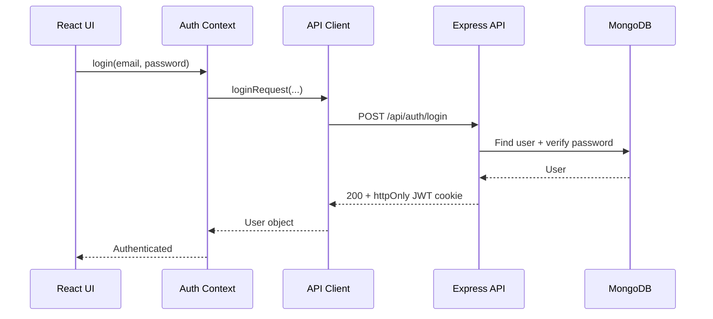
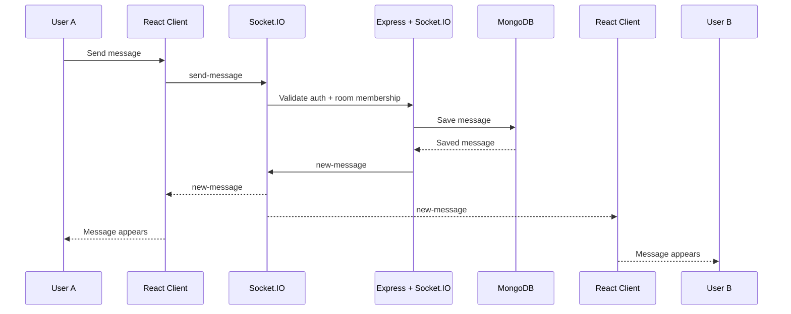
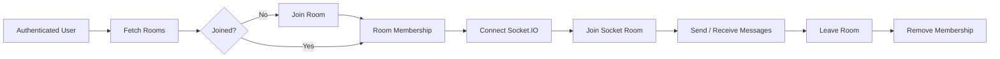
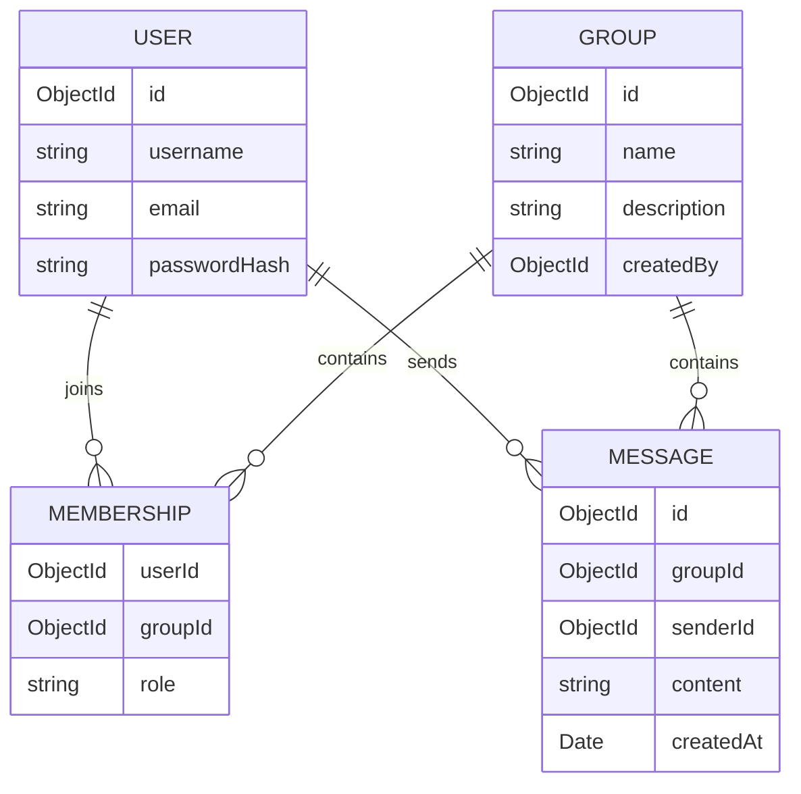

<div align="center">

# ◇ MysteryChat

**A real-time anonymous chat platform built with React, Express, MongoDB, and Socket.IO.**


</div>

---

| | |
|---|---|
| 🔐 Auth | JWT authentication using `httpOnly` cookies |
| 💬 Real-time Chat | Socket.IO-powered room messaging with instant delivery |
| 🚪 Chat Rooms | Create, join, and leave public conversation rooms |
| 👥 Membership | Room members, roles, and member counts |
| 🗄️ Persistence | MongoDB stores users, rooms, memberships, and messages |
| 🛡️ Authorization | Protected API routes and Socket.IO room access |
| ⚡ Frontend | React + Vite with centralized API and authentication state |
| 📱 Responsive UI | Dark, responsive interface designed for desktop and mobile |

---

## Request Flow



---

## Real-time Chat Flow



---

## Room Flow



---

## Architecture

```mermaid
flowchart TB

    subgraph Frontend
        UI[React Pages]
        Auth[Auth Context]
        API[API Client]
        Socket[Socket.IO Client]

        UI --> Auth
        UI --> API
        UI --> Socket
    end

    API -->|REST + Credentials| Backend
    Socket -->|WebSocket| Realtime

    subgraph Backend
        Backend[Express API]
        Routes[Routes]
        Controllers[Controllers]
        Middleware[Auth Middleware]
        Models[Mongoose Models]

        Backend --> Routes
        Routes --> Middleware
        Routes --> Controllers
        Controllers --> Models
    end

    subgraph Realtime
        Realtime[Socket.IO Server]
        Events[Room Events]
        Validation[Auth + Membership Validation]

        Realtime --> Events
        Events --> Validation
    end

    Models --> DB[(MongoDB)]
    Controllers --> DB
    Events --> DB
```

---

## Stack

| Layer             | Technology                |
| ----------------- | ------------------------- |
| Frontend          | React, Vite, React Router |
| Styling           | Tailwind CSS              |
| Backend           | Node.js, Express          |
| Database          | MongoDB, Mongoose         |
| Authentication    | JWT + `httpOnly` cookies  |
| Real-time         | Socket.IO                 |
| Password Security | bcrypt                    |
| API               | REST                      |
| Deployment        | Vercel + Render           |

---

## Core Features

### Authentication

* User registration
* User login
* User logout
* Session restoration
* Protected routes
* Password hashing
* JWT authentication
* `httpOnly` authentication cookie

Authentication flow:

```text
Register
   ↓
Hash Password
   ↓
MongoDB
   ↓
Login
   ↓
Verify Password
   ↓
Generate JWT
   ↓
httpOnly Cookie
   ↓
Authenticated Session
```

---

### Chat Rooms

Users can:

* Create rooms
* Browse available rooms
* Join rooms
* Leave rooms
* View member counts
* Enter conversations
* Participate in real-time messaging

Room roles:

```text
admin
member
```

The creator of a room becomes its administrator.

---

### Real-time Messaging

MysteryChat uses Socket.IO for real-time communication instead of repeatedly polling the backend.

Client:

```js
socket.emit("send-message", {
  content,
});
```

Server:

```text
send-message
      ↓
Authenticate user
      ↓
Validate room membership
      ↓
Save message
      ↓
Broadcast new-message
      ↓
Connected clients update instantly
```

This allows multiple users in the same room to receive messages without refreshing the page.

---

## Socket.IO Events

| Event           | Direction       | Purpose                       |
| --------------- | --------------- | ------------------------------ |
| `join-room`     | Client → Server | Join a chat room              |
| `leave-room`    | Client → Server | Leave current socket room     |
| `send-message`  | Client → Server | Send a new message            |
| `new-message`   | Server → Client | Broadcast a saved message     |
| `room-error`    | Server → Client | Room operation error          |
| `message-error` | Server → Client | Message operation error       |
| `connect`       | Server → Client | Socket connection established |
| `disconnect`    | Server → Client | Socket connection closed      |

---

## API

| Method | Route                      |  🔒 | Description              |
| ------ | -------------------------- | :-: | ------------------------ |
| POST   | `/api/auth/register`       |     | Create account           |
| POST   | `/api/auth/login`          |     | Log in                   |
| POST   | `/api/auth/logout`         |  🔒 | Log out                  |
| GET    | `/api/auth/me`             |  🔒 | Restore current session  |
| GET    | `/api/groups`              |  🔒 | List available rooms     |
| POST   | `/api/groups`              |  🔒 | Create a room            |
| POST   | `/api/groups/:id/join`     |  🔒 | Join a room              |
| POST   | `/api/groups/:id/leave`    |  🔒 | Leave a room             |
| GET    | `/api/groups/:id/messages` |  🔒 | Get room message history |
| GET    | `/health`                  |     | API health check         |

---

## Data Model



---

## Project Structure

```text
mysterychat/
│
├── backend/
│   ├── src/
│   │   ├── config/
│   │   │   └── database.js
│   │   │
│   │   ├── controllers/
│   │   │
│   │   ├── middleware/
│   │   │
│   │   ├── models/
│   │   │
│   │   ├── routes/
│   │   │
│   │   └── socket/
│   │
│   ├── server.js
│   ├── package.json
│   └── .env.example
│
└── frontend/
    ├── src/
    │   ├── components/
    │   ├── context/
    │   ├── lib/
    │   ├── pages/
    │   ├── socket.js
    │   └── App.jsx
    │
    ├── index.html
    ├── package.json
    └── .env.example
```

---

## Environment Variables

### Backend

Create:

```bash
cp .env.example .env
```

Configure:

```env
MONGO_URI=your_mongodb_connection_string
JWT_SECRET=your_long_random_secret
CLIENT_URL=http://localhost:5173
NODE_ENV=development
PORT=5000
```

For production:

```env
MONGO_URI=your_mongodb_connection_string
JWT_SECRET=your_long_random_secret
CLIENT_URL=https://your-frontend.vercel.app
NODE_ENV=production
```

---

### Frontend

Create:

```bash
cp .env.example .env
```

Configure:

```env
VITE_API_URL=http://localhost:5000/api
VITE_SOCKET_URL=http://localhost:5000
```

For production:

```env
VITE_API_URL=https://your-backend.onrender.com/api
VITE_SOCKET_URL=https://your-backend.onrender.com
```

---

## Run Locally

### Backend

```bash
cd backend
npm install
cp .env.example .env
npm run dev
```

Backend:

```text
http://localhost:5000
```

---

### Frontend

Open another terminal:

```bash
cd frontend
npm install
cp .env.example .env
npm run dev
```

Frontend:

```text
http://localhost:5173
```

---

## Production Deployment

### Backend

Deploy the backend as a Node.js Web Service.

```text
Build Command:
npm ci

Start Command:
npm start
```

The backend should listen on:

```text
0.0.0.0
```

and use the port supplied by the hosting platform.

---

### Frontend

Deploy the frontend as a Vite application.

```text
Framework:
Vite

Root Directory:
frontend

Build Command:
npm run build

Output Directory:
dist
```

Set:

```env
VITE_API_URL=https://your-backend.onrender.com/api
VITE_SOCKET_URL=https://your-backend.onrender.com
```

---

## Security

MysteryChat uses several server-side protections:

* Password hashing with bcrypt
* JWT authentication
* `httpOnly` cookies
* Protected API routes
* Socket.IO authentication
* Room membership validation
* Message authorization
* Server-side message validation
* Environment variables for secrets
* CORS configuration
* MongoDB persistence

The client never needs direct access to the JWT.

```text
Browser
   │
   │ HTTP request
   ▼
httpOnly Cookie
   │
   ▼
Express Middleware
   │
   ▼
JWT Verification
   │
   ▼
Authenticated User
```

---

## Why Socket.IO?

Traditional polling requires the browser to repeatedly ask:

```text
"Are there new messages?"
```

MysteryChat maintains a persistent real-time connection:

```text
Client
  │
  │ WebSocket
  ▼
Socket.IO
  │
  ├── Room A
  ├── Room B
  └── Room C
```

When a message is created:

```text
User A
   ↓
Socket.IO
   ↓
Server validation
   ↓
MongoDB
   ↓
Socket.IO broadcast
   ↓
User B + User C + User A
```

This allows messages to be delivered to connected users without page refreshes or client-side polling.

---

## Engineering Decisions

### Why JWT in an `httpOnly` cookie?

The authentication token is kept out of JavaScript-accessible storage.

```text
JWT
 ↓
httpOnly Cookie
 ↓
Browser automatically sends it
 ↓
Server validates it
```

This reduces exposure of the token to client-side JavaScript compared with storing it directly in `localStorage`.

---

### Why REST + Socket.IO?

REST handles persistent resource operations:

```text
Authentication
Rooms
Membership
Message history
```

Socket.IO handles events that require immediate delivery:

```text
Join room
Leave room
Send message
Receive message
```

This separates resource management from real-time communication.

---

## Scaling the Real-time Layer

A future horizontally scaled architecture can use Redis as a Socket.IO adapter:

```text
                    Load Balancer
                         │
              ┌──────────┴──────────┐
              │                     │
          API Server 1          API Server 2
              │                     │
              └──────────┬──────────┘
                         │
                    Redis Adapter
                         │
                    Socket.IO
                         │
                      MongoDB
```

Redis can synchronize Socket.IO events across multiple backend instances while MongoDB remains the persistent data layer.

---

## Future Improvements

* Message expiration
* Anonymous guest sessions
* Private rooms
* Typing indicators
* Online presence
* Read receipts
* Message reactions
* Message deletion
* Rate limiting
* Redis-backed Socket.IO scaling
* Redis-backed sessions
* Moderation and abuse controls
* End-to-end encryption

---

## License

MIT

---

<div align="center">

**Built solo · Real-time communication with React, Express, MongoDB & Socket.IO**

</div>
